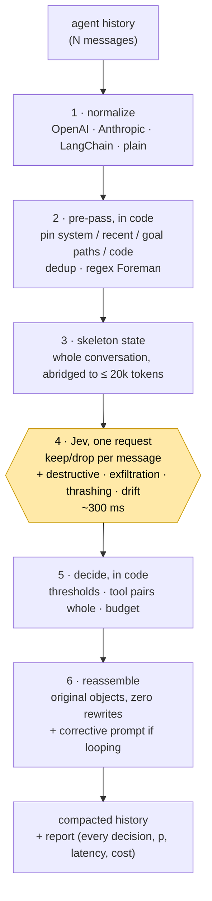
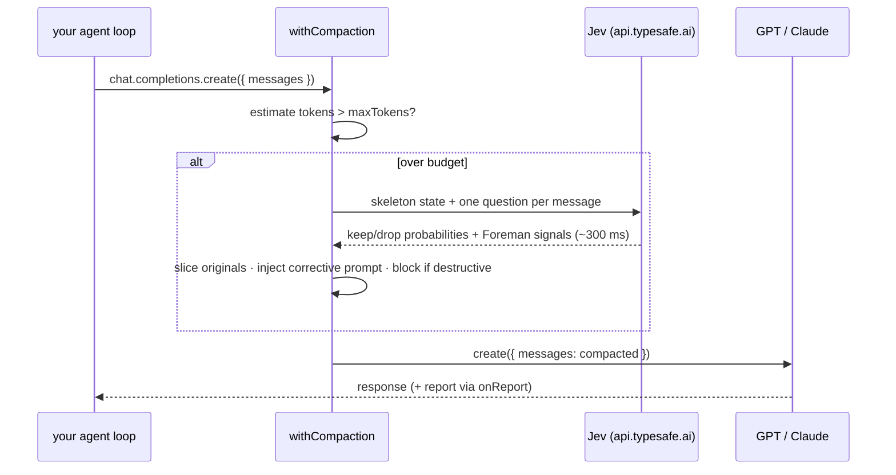

# jev-compactor: deterministic context compaction for AI agents

[](https://www.npmjs.com/package/jev-compactor)
[](https://github.com/edwardyen724-g/jev-compactor/actions/workflows/ci.yml)
[](LICENSE)
[](https://nodejs.org)

**jev-compactor** is an open-source TypeScript library, CLI and MCP server that reduces an AI
agent's context window without summarizing it. It keeps the original messages byte for byte, drops
the ones [TypeSafe's Jev](https://typesafe.ai) judges irrelevant to the current goal, and catches
destructive commands such as `rm -rf` in the same ~300 ms pass. It is framework-agnostic: it wraps
an OpenAI, Anthropic or LangChain client in two lines, works on plain `{role, content}` message
arrays, and runs from a CLI or as an MCP server.

Jev is TypeSafe's System One model: it does not generate text. It takes a state plus named
questions and returns calibrated probabilities, evaluating every question in parallel against the
same state. jev-compactor asks it one question per message — *should this stay in working memory
for the goal?* — and decides everything else in code.

**Jev judges relevance. Code decides structure.** Nothing kept is ever rewritten; every drop is
attributable with a probability; destructive commands and thrashing loops are caught in the same
~300 ms pass that compacts the history.

```ts
import { withCompaction } from 'jev-compactor';

const openai = withCompaction(new OpenAI(), { maxTokens: 15_000, safetyGating: true });
```

## Install

```sh
npm install jev-compactor
```

Node ≥ 20. You need a TypeSafe API key in `TYPESAFE_API_KEY` (get one at
[typesafe.ai](https://typesafe.ai), or pass `apiKey`). The CLI, the MCP server and the tests also
read the nearest `.env.local` / `.env`.

From source: `git clone https://github.com/edwardyen724-g/jev-compactor && cd jev-compactor &&
pnpm install && pnpm build:lib`; the CLI is then `node packages/jev-compactor/dist/cli.mjs`.

Every option, the CLI reference, the MCP tool table and the report interfaces are in the
[package README](packages/jev-compactor/README.md). A step-by-step walkthrough, from `inspect` to
the safety gate to Claude Code / Cursor over MCP, is [docs/TUTORIAL.md](docs/TUTORIAL.md).

## When to use jev-compactor, and when not to

Use it when:

- your agent runs long, tool-using sessions on OpenAI, Anthropic, LangChain or plain message
  arrays, and the history outgrows the window;
- the continuation must still see the exact file paths, error messages and commands from early
  turns, so a paraphrase is not acceptable;
- you want every drop explained, with a reason and a probability, in a report your tooling can read;
- you want `rm -rf`, force-pushes, `DROP TABLE`, `curl | sh` and leaked keys flagged or blocked
  before they reach the model, without a second model call.

Do not use it when:

- your agent is Claude Code: [tamaratran/fast-jev-compaction](https://github.com/tamaratran/fast-jev-compaction)
  is a plugin for that transcript format and is the shorter path (see
  [jev-compactor vs fast-jev-compaction](#jev-compactor-vs-fast-jev-compaction));
- you cannot send an abridged copy of the conversation to `api.typesafe.ai` (see
  [Data leaves your machine](#data-leaves-your-machine));
- you need the hardest possible compression and can tolerate paraphrase: in the benchmark below,
  LLM summarization saved 96.2% where jev-compactor saved 64.5%, at 17× the latency, 76× the cost,
  and with one file path that does not exist in the transcript;
- the history fits the budget: `withCompaction` sends nothing to Jev below `maxTokens`; only the
  local regex floor and the gate run.

## Why not summarize or truncate the context window?

When an agent's context fills up, every mainstream framework does one of two things: ask the model
to **summarize** the history, or **truncate** the oldest turns. Both lose exactly the thing an agent
needs most in a long task — the verbatim file path, error message, or command from twenty turns ago.
jev-compactor reduces the token count a third way: it drops whole messages that Jev rates
irrelevant to the goal and leaves the rest untouched.

| | LLM summarization | Oldest-first truncation | **jev-compactor** |
|---|---|---|---|
| What survives | a paraphrase | whatever is recent | the original messages, byte for byte |
| Relevance to the current goal | implicit, model-dependent | none | one calibrated keep/drop probability per message |
| Latency per compaction | seconds (a full generation) | ~0 ms | **~0.2–0.5 s** for a 25k-token history ([measured](docs/JEV-API.md#measured-latency-2026-09-18-jev-1130)) |
| Cost per compaction | tens of thousands of frontier tokens | free | **≈ $0.001** (Jev bills $0.042 per million input tokens) |
| Invented file paths / errors | possible | impossible | impossible by construction |
| Deterministic for the same input | no | yes | yes given the same answers; Jev's probabilities can move a threshold-adjacent message between runs |
| Tool call ↔ tool result pairs | rewritten away | can be split | never split |
| Why was this dropped? | unknowable | position | a reason and a probability in the report |
| Destructive command / loop detection | no | no | in the same pass, with a regex floor in code |

### Benchmark: jev-compactor vs truncation vs LLM summarization

On one 64-message, 12.7k-token agent session with a 6k-token budget, jev-compactor cut tokens by
64.5% in 366 ms for $0.0004 with zero hallucinated file paths and all 4 early facts retained;
oldest-first truncation cut 53.0% but kept 1 of 4 facts; Claude Sonnet 5 summarization cut 96.2%
in 6.1 s for $0.0305 and wrote one file path that does not exist in the transcript. Measured 2026-09-18 with `jev-1.13.0`; the metrics,
raw results and reproduce commands are in [docs/BENCHMARK.md](docs/BENCHMARK.md).

| | saved | latency | cost | hallucinated paths | evidence retained |
|---|---|---|---|---|---|
| **jev-compactor** | **64.5%** | **366 ms** | **$0.0004** | **0** | **4 of 4** |
| truncate oldest | 53.0% | 1 ms | $0 | 0 | 1 of 4 |
| summarize (Claude Sonnet 5) | 96.2% | 6.1 s | $0.0305 | 1 | 3 of 4 |

The four facts are two ticket ids, a schema-freeze constraint and the original failure text, all
stated only in the first turns and all needed for the final answer. The transcript is synthetic and
checked into the repo so the numbers are reproducible; it is one session, not a survey of your agent.

## How it works



1. **Normalize.** Any supported message shape becomes a list of frames; an assistant message that
   issues tool calls and the tool messages that answer it form one unit, kept or dropped together.
2. **Pre-pass, in code.** System messages, the newest turns, messages mentioning a file path that the
   goal mentions, and recent code blocks are pinned. Exact duplicates are deduped. A fixed regex list
   flags `rm -rf`, force-pushes, `DROP TABLE`, `curl | sh`, leaked-key patterns and the like, whatever
   Jev later says.
3. **Skeleton state.** The whole conversation, abridged (long tool outputs become `ok, 4213 chars
   (omitted)`), goes to Jev as read-only state — never a slice, because "superseded by a later
   message" needs the later message in view.
4. **Jev, one request.** One `choice` question per candidate message — *should `messages[k]` stay in
   working memory to accomplish `goal`?* — plus `noul` questions for destructive commands, data
   exfiltration, thrashing and goal drift, all evaluated in parallel by a model that answers with
   calibrated probabilities instead of text.
5. **Decide, in code.** A message is dropped only when P(drop) ≥ 0.7. Tool pairs stay whole, a minimum
   survives, and if the result is still over budget the least-certain keeps go first, deterministically.
6. **Reassemble.** The output array holds the caller's original objects. If Jev saw the agent looping
   or drifting, a short corrective system message is appended; if it saw a destructive action and
   `safetyGating` is on, the call is blocked until an escrow hook approves.

Every step except 4 is plain TypeScript with no model in the loop, so the contract is checkable:
kept messages are `===` the inputs, no result is ever without its call, and every drop carries a
reason and a probability.

### Where it sits in your loop

`withCompaction` intercepts the wrapped call (`chat.completions.create`, `messages.create`, `invoke`
or a plain function), estimates the history's tokens, and only when the estimate exceeds `maxTokens`
sends an abridged copy to Jev. Jev returns the keep/drop probabilities and the Foreman safety signals
in one ~300 ms request; the wrapper then slices the original array, appends a corrective prompt if
the agent was looping or drifting, blocks the call if `safetyGating` is on and the pending action is
destructive, and forwards the compacted history to the model.



`withCompaction` wraps a function, an OpenAI-style client, an Anthropic-style client or a
LangChain runnable without changing your code. `compact()` does the same as a plain function, and
the CLI (`jev-compactor inspect history.json`) shows every decision in the terminal: green kept, dim
dropped with its probability, red flagged.

## Safety gating: `rm -rf`, force-pushes and secret exfiltration

The same Jev request that scores relevance also answers the **Foreman** questions (the safety
gate): is the pending action destructive, does it exfiltrate data, is the agent thrashing, has it
drifted from the goal. Independently of Jev, a fixed regex list in code flags `rm -rf`,
`git push --force`, `git reset --hard`, `DROP TABLE`, `curl | sh`, keys in outbound commands and
`.env` reads — unconditionally, with no network.

With `safetyGating: true`, a call whose **pending action** — the agent's latest message or tool
call — carries an action-level `destructive` or `exfiltration` finding throws
`CompactionBlockedError`, carrying the finding and the full result, instead of reaching the model,
unless your `onEscrow` hook returns `'approve'`. The gate runs on every call, over budget or not.
Findings about earlier turns (a proposal the user already rejected, the user's own warning, a
command a tool result merely quotes) are reported and flagged but do not block; thrashing and goal
drift never block — they inject the corrective prompt. A blocked call never arms the cooldown, so a
retry is gated again.

To run the Foreman alone over one proposed command or tool call, use the MCP server's
`check_action` tool; on the CLI, `--safety` exits 2 when an action-level finding blocks.

## Works with OpenAI, Anthropic, LangChain, plain messages and MCP

`withCompaction(target, options)` detects the target's shape, never mutates it, and returns a proxy
of the same type:

| Target | What is wrapped |
|---|---|
| a function `(messages, ...rest) => …` | `messages` |
| an OpenAI-style client (`chat.completions.create`) | `params.messages` |
| an Anthropic-style client (`messages.create`) | `params.messages`; a corrective prompt is appended to `params.system` |
| a LangChain-style runnable (`invoke`) | a message array, or `{ messages }` |

`compact(messages, options)` does the same as a plain function on any of these formats; `format`
defaults to `'auto'` and can be forced to `openai`, `anthropic`, `langchain` or `plain`.

The MCP server, `jev-compactor-mcp`, speaks MCP over stdio and is the bridge for Python and other
non-JavaScript agents (CrewAI, custom loops): send the history, get the kept subset back. Register it
with any MCP client:

```json
{
  "mcpServers": {
    "jev-compactor": {
      "command": "npx",
      "args": ["-y", "--package=jev-compactor", "jev-compactor-mcp"],
      "env": { "TYPESAFE_API_KEY": "…" }
    }
  }
}
```

| Tool | Input | Output |
|---|---|---|
| `compact_context` | `{ messages, goal?, maxTokens?, safetyGating?, format? }` | `{ messages, report, blocked, systemAddendum? }` |
| `inspect_context` | `{ messages, goal? }` | the `inspect` view as text, then the report as JSON |
| `check_action` | `{ action, goal? }` | `{ findings, blocked }` — the Foreman alone, over one proposed command or tool call |

## jev-compactor vs fast-jev-compaction

[tamaratran/fast-jev-compaction](https://github.com/tamaratran/fast-jev-compaction) (MIT,
2026-09-17) established Jev-scored verbatim compaction for Claude Code transcripts a day before this
repo existed: tool pairs as candidates, a whole-conversation state with staged abridging, question
batches under the request limit, nothing kept ever rewritten. This project's skeleton-state design
converged on that shape after a per-window design failed the "superseded by a later message" test.
jev-compactor is the framework-agnostic, safety-gating, telemetry-emitting middleware version of that
idea.

| | fast-jev-compaction | jev-compactor |
|---|---|---|
| Input | Claude Code transcripts | OpenAI, Anthropic, LangChain and plain message arrays; any MCP client |
| Ships as | Claude Code plugin + npm library | npm library, CLI (`compact`, `inspect`), MCP server (`compact_context`, `inspect_context`, `check_action`) |
| Candidates for dropping | tool call / result pairs | text messages and tool pairs, with deterministic pins in code (system, recency, goal paths, code) |
| Stale tool results | dropped or truncated | dropped whole; keep-the-call-truncate-the-result is reserved for v0.2 (`allowTruncate`) |
| Kept messages | verbatim | verbatim (`===` the caller's objects) |
| Safety gating | not part of the plugin as surveyed 2026-09-18 | Foreman questions in the same Jev pass, regex floor in code, `onEscrow` hook, `CompactionBlockedError` |
| Report | — | per-decision reason and probability, Foreman findings, Jev telemetry, as typed JSON |
| Published benchmark | none found as of 2026-09-18 | [docs/BENCHMARK.md](docs/BENCHMARK.md), vs truncation and LLM summarization |
| License | MIT | MIT |

Their column reflects their README and the survey in [docs/LANDSCAPE.md](docs/LANDSCAPE.md) as of
2026-09-18; open an issue if it has gone out of date. If you live in Claude Code, their plugin is the
shorter path. jev-compactor is the alternative for everything that is not a Claude Code transcript.

## Packages and docs

| Package | What |
|---|---|
| [`packages/jev-compactor`](packages/jev-compactor/README.md) | the open-source core: library, CLI, MCP server — install, options and the report shape |
| [`packages/bench`](packages/bench/README.md) | benchmark harness: jev-compactor vs truncation vs LLM summarization |
| `apps/cloud` | Sealed Context Cloud — telemetry, visual debugger, escrow (Phase 2, not started) |

Docs: [tutorial](docs/TUTORIAL.md) · [product spec](docs/PRODUCT.md) ·
[architecture](docs/ARCHITECTURE.md) · [Jev API notes](docs/JEV-API.md) ·
[benchmark](docs/BENCHMARK.md) · [landscape](docs/LANDSCAPE.md) · [build plan](docs/BUILD-PLAN.md)

Markdown for agents: [raw README](https://raw.githubusercontent.com/edwardyen724-g/jev-compactor/main/README.md)
· [llms.txt](https://raw.githubusercontent.com/edwardyen724-g/jev-compactor/main/llms.txt)

## FAQ

### How do I reduce an agent's context tokens without summarizing?

Wrap the client: `withCompaction(new OpenAI(), { maxTokens: 15_000 })`. When the estimated history
exceeds `maxTokens`, jev-compactor drops the messages Jev rates irrelevant to the goal and passes the
rest through untouched; nothing is paraphrased. On the benchmark session that removed 64.5% of the
tokens with every early fact still present verbatim.

### Is jev-compactor the same as fast-jev-compaction?

No. fast-jev-compaction is a Claude Code plugin that established Jev-scored verbatim compaction for
Claude Code transcripts a day before this repo existed, and this project's skeleton-state design
converged on its shape. jev-compactor is the framework-agnostic version: OpenAI, Anthropic,
LangChain and plain message arrays, an MCP server, text messages as candidates with pins in code,
the Foreman safety gate and a report built for tooling. If you live in Claude Code, their plugin is
the shorter path.

### Does jev-compactor work with LangChain, OpenAI, Anthropic and MCP?

Yes. `withCompaction` detects an OpenAI-style client (`chat.completions.create`), an
Anthropic-style client (`messages.create`), a LangChain runnable (`invoke`) or a plain function;
`compact()` accepts the same message shapes, LangChain message class instances included. Anything
else goes through the MCP server, which any MCP client can call.

### How much does a compaction cost?

Jev bills $0.042 per million input tokens and output is free, so a compaction of a 25k-token
history is typically ≈ $0.001 and 0.2–0.5 s. The benchmark's 64-message, 12.7k-token session cost
$0.0004 with jev-compactor and $0.0305 with Claude Sonnet 5 summarization.

### How much latency does compaction add?

One Jev request, about 300 ms: 366 ms on the benchmark session, 0.2–0.5 s for a 25k-token history.
With `withCompaction` it runs only when the history exceeds `maxTokens`, and the next
`cooldownTurns` calls (default 1) pass straight through.

### Does jev-compactor send my data anywhere?

Yes, when a compaction runs: an abridged copy of the conversation — the goal and an excerpt of every
message, tool inputs and the head of tool results — is sent to `api.typesafe.ai`. Nothing is sent
when a run is skipped (below threshold, cooldown), and the regex floor runs locally. See
[Data leaves your machine](#data-leaves-your-machine).

### Is the output deterministic?

Given the same Jev answers, yes: pins, dedup, thresholds, tool-pair handling and the over-budget
ordering are plain code, and the paired runs in the benchmark harness record whether the output was
identical. Jev's probabilities are not bit-stable: across four identical requests on the benchmark
transcript, P(keep) for a unit moved by up to 0.14 with no decision changing, but a unit near the
0.7 drop threshold can flip between runs (it happened twice in nine transcript-runs). Raise
`dropThreshold` if that matters more to you than compaction ratio.

### What happens when Jev is unreachable?

The history goes through unchanged with `report.skipped = 'jev_unavailable'` and `report.error`
set; the regex Foreman still runs and its findings are still reported. The CLI prints
`jev-compactor: jev unavailable: <reason>` so a silent no-op never looks like success. Set
`failClosed: true` to throw `CompactionUnavailableError` instead, for deployments where an
uncompacted history must not reach the model.

### Can I use jev-compactor from Python or another language?

Through the MCP server: register `jev-compactor-mcp` (stdio) with your MCP client and call
`compact_context`, `inspect_context` or `check_action`. There is no Python package.

## Data leaves your machine

> Data leaves your machine when compaction runs: an abridged copy of the conversation is sent to
> `api.typesafe.ai`. Review your data policy before enabling it on private code.

Nothing is sent when a run is skipped (below threshold, cooldown), and the regex floor runs locally;
a compaction is a network call carrying your agent's history. Review your data policy and
TypeSafe's before enabling it on private code or customer data.

## License

MIT © 2026 Edward Yen — see [LICENSE](LICENSE).
