# jev-compactor

Deterministic context compaction and safety gating for AI agents, powered by
[TypeSafe's Jev](https://typesafe.ai). Framework-agnostic: works on OpenAI, Anthropic, LangChain and
plain `{role, content}` message arrays, from a CLI, or as an MCP server.

**Jev judges relevance. Code decides structure.** Nothing kept is ever rewritten; every drop is
attributable with a probability; destructive commands and thrashing loops are caught in the same
~300 ms pass that compacts the history.

```ts
import { withCompaction } from 'jev-compactor';

const agent = withCompaction(new Agent(), { maxTokens: 15_000, safetyGating: true });
```

## Why not vanilla compaction?

When an agent's context fills up, every mainstream framework does one of two things: ask the model
to **summarize** the history, or **truncate** the oldest turns. Both lose exactly the thing an agent
needs most in a long task — the verbatim file path, error message, or command from twenty turns ago.

| | LLM summarization | Oldest-first truncation | **jev-compactor** |
|---|---|---|---|
| What survives | a paraphrase | whatever is recent | the original messages, byte for byte |
| Relevance to the current goal | implicit, model-dependent | none | one calibrated keep/drop probability per message |
| Latency per compaction | seconds (a full generation) | ~0 ms | **~0.2–0.5 s** for a 25k-token history ([measured](docs/JEV-API.md#measured-latency-from-projectsjev-context-2026-09-18-jev-1130)) |
| Cost per compaction | tens of thousands of frontier tokens | free | **≈ $0.001** (Jev bills $0.042 per million input tokens) |
| Invented file paths / errors | possible | impossible | impossible by construction |
| Deterministic for the same input | no | yes | yes given the same answers; Jev's probabilities can move a threshold-adjacent message between runs |
| Tool call ↔ tool result pairs | rewritten away | can be split | never split |
| Why was this dropped? | unknowable | position | a reason and a probability in the report |
| Destructive command / loop detection | no | no | in the same pass, with a regex floor in code |

Measured on a 64-message, 12.7k-token session with a 6k budget ([docs/BENCHMARK.md](docs/BENCHMARK.md)):

| | saved | latency | cost | hallucinated paths | evidence retained |
|---|---|---|---|---|---|
| **jev-compactor** | **64.5%** | **366 ms** | **$0.0004** | **0** | **4 of 4** |
| truncate oldest | 53.0% | 1 ms | $0 | 0 | 1 of 4 |
| summarize (Claude Sonnet 5) | 96.2% | 6.1 s | $0.0305 | 1 | 3 of 4 |

The four facts are two ticket ids, a schema-freeze constraint and the original failure text, all
stated only in the first turns and all needed for the final answer.

## How it works

```mermaid
flowchart LR
    A["agent history<br/>(N messages)"] --> B["1 · normalize<br/>OpenAI · Anthropic · LangChain · plain"]
    B --> C["2 · pre-pass, in code<br/>pin system / recent / goal paths / code<br/>dedup · regex foreman"]
    C --> D["3 · skeleton state<br/>whole conversation, abridged to ≤ 20k tokens"]
    D --> E{{"4 · Jev, one request<br/>keep/drop per message<br/>+ destructive · exfiltration · thrashing · drift<br/>~300 ms"}}
    E --> F["5 · decide, in code<br/>thresholds · tool pairs whole · budget"]
    F --> G["6 · reassemble<br/>original objects, zero rewrites<br/>+ corrective prompt if looping"]
    G --> H["compacted history<br/>+ report (every decision, p, latency, cost)"]
    style E fill:#ffe9a8,stroke:#c99a00,color:#000
```



1. **Normalize.** Any supported message shape becomes a list of frames; an assistant message that
   issues tool calls and the tool messages that answer it form one unit, kept or dropped together.
2. **Pre-pass, in code.** System messages, the newest turns, messages mentioning a file path that the
   goal mentions, and recent code blocks are pinned. Exact duplicates are deduped. A fixed regex list
   flags `rm -rf`, force-pushes, `DROP TABLE`, `curl | sh`, leaked-key patterns and the like, whatever
   Jev later says.
3. **Skeleton state.** The whole conversation, abridged (long tool outputs become `ok, 4213 chars
   (omitted)`), goes to Jev as read-only state — never a slice, because "superseded by a later
   message" needs the later message in view.
4. **Jev, one request.** One `choice` question per candidate message — *should `messages[k]` stay in
   working memory to accomplish `goal`?* — plus `noul` questions for destructive commands, data
   exfiltration, thrashing and goal drift, all evaluated in parallel by a model that answers with
   calibrated probabilities instead of text.
5. **Decide, in code.** A message is dropped only when P(drop) ≥ 0.7. Tool pairs stay whole, a minimum
   survives, and if the result is still over budget the least-certain keeps go first, deterministically.
6. **Reassemble.** The output array holds the caller's original objects. If Jev saw the agent looping
   or drifting, a short corrective system message is appended; if it saw a destructive action and
   `safetyGating` is on, the call is blocked until an escrow hook approves.

Every step except 4 is plain TypeScript with no model in the loop, so the contract is checkable:
kept messages are `===` the inputs, no result is ever without its call, and every drop carries a
reason and a probability.

### Where it sits in your loop


`withCompaction` wraps a function, an OpenAI-style client, an Anthropic-style client or a
LangChain runnable without changing your code. `compact()` does the same as a plain function, and
the CLI (`jev-compactor inspect history.json`) shows every decision in the terminal: green kept, dim
dropped with its probability, red flagged.

## Packages

| Package | What |
|---|---|
| [`packages/jev-compactor`](packages/jev-compactor) | the open-source core: library, CLI, MCP server — see its README for install, options and the report shape |
| [`packages/bench`](packages/bench) | benchmark harness: jev-compactor vs truncation vs LLM summarization |
| `apps/cloud` | Sealed Context Cloud — telemetry, visual debugger, escrow (Phase 2, not started) |

Docs: [product spec](docs/PRODUCT.md) · [architecture](docs/ARCHITECTURE.md) ·
[Jev API notes](docs/JEV-API.md) · [benchmark](docs/BENCHMARK.md) · [landscape](docs/LANDSCAPE.md) ·
[build plan](docs/BUILD-PLAN.md)

## Prior art

[tamaratran/fast-jev-compaction](https://github.com/tamaratran/fast-jev-compaction) established
Jev-scored verbatim compaction for Claude Code transcripts a day before this repo existed. This
project is the framework-agnostic, safety-gating, telemetry-emitting middleware version of that idea.

> Data leaves your machine when compaction runs: an abridged copy of the conversation is sent to
> `api.typesafe.ai`. Review your data policy before enabling it on private code.

MIT © 2026 Edward Yen
